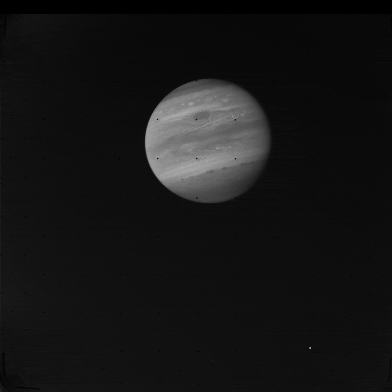

<h1>PyVoyager</h1>

PyVoyager automatically creates and stabilizes Voyager flyby movies - the eventual goal is to produce a single movie with titles and audio as automatically as possible, with each planet and target having a separate segment. 

- [About](#about)
- [Example Movies](#example-movies)
- [Sources](#sources)
- [Contributing](#contributing)
- [Usage](#usage)
- [Install](#install)
- [Technical](#technical)
- [History](#history)
- [License](#license)
  
## About

Voyager 1 and 2 sent back over 70,000 images, so there is a lot to explore! 

Unfortunately the cameras were not able to point very accurately at their targets, resulting in jittery image sequences. PyVoyager centers the target planet or moon in the frame, and creates movies from the image sequences.

## Example Movies

Here is an example image sequence, followed by the centered version - 

 

 

And here is Voyager 2's flyby of Io, partially colored - any mini 'volcanoes' are actually leftover from the removal of reseau marks (a grid of black dots) -

Here is a movie of Voyager 1's Jupiter flyby (3 mins), mostly false color, v0.47 -

https://www.youtube.com/watch?v=lYUgU-Bc1_w  

And there is a playlist with several movies here - 

https://www.youtube.com/playlist?list=PLxP4UgQGtMiLvyKjT7BQ-ht905VvNSaFP

<!-- https://www.youtube.com/watch?v=_YT4XINDxjk  
Voyager 2 Uranus system flyby in color and black and white v0.43

https://www.youtube.com/watch?v=rAGWBo3-J2E  
Voyager 1 Jupiter rotation movie color v0.41

https://www.youtube.com/watch?v=kcJB9rNzCH4  
Voyager 2 Triton flyby v0.32

https://www.youtube.com/watch?v=VF3UCo2P-4Y  
Voyager 2 Neptune flyby v0.2 - note Triton orbiting Neptune in a retrograde direction

https://www.youtube.com/watch?v=c8O2BKqM0Qc  
Voyager 2 Neptune flyby color v0.2 - automatically colorized version

https://www.youtube.com/watch?v=o4zh8C-ma_A  
Voyager 1 Jupiter approach v0.1 - (RAW images with reseau marks) -->

## Sources

Images were obtained from the __

They provide four types for each image: 

- RAW - the original 800x800px raw images, with reseau marks. 8bit
- CLEANED - same as above, with reseau marks removed. 8bit
- CALIB -  above, with flatfield subtracted. 16bit
- GEOMED - the above, with geometry corrected via reseau marks. 16bi

You can see them each in the following animation:

You can read more about the Planetary Data System (PDS) which hosts the archives [here][pds].

## Contributing

Although the goal is to complete the movies in as automated fashion as possible, there are still places where manual intervention is required - 

- Some frames don't get centered correctly due to noise, or being on the edge of an image, etc., so they need to be manually centered by editing the `db/centersOverride.csv` file, or (eventually) using the `vg center <imageId> <x offset>, <y offset>` command.
- Centering needs to be manually turned off at close approach and back on again at departure - this is done in `db/centering.csv`. 
- Multi-target images often need to be relabelled to the largest target in the image (or whatever the centering routines center on) - this is done in the `db/retargeting.csv` file.
- Close-up composite images need to be manually aligned - e.g. the closeups of the clouds of Jupiter, by editing the `db/composites.csv` file. The weight of the different filters can also be adjusted there. 
- Movie frame rates need to be adjusted so interesting images stay on the screen longer - this is done in the `db/framerates.csv` file. 
- And eventually, mosaics would need to be specified manually in a `db/mosaics.csv` file. 

There are also more technical tasks listed in the Trello board [here][trello].

## Usage

For more on how to use the program, see [USAGE.md](USAGE.md).

## Install

For more on how to install the program, see [INSTALL.md](INSTALL.md).

## Technical

For more technical details on the algorithms used, see [TECHNICAL.md](TECHNICAL.md).

## History

For the program and movie version history see [HISTORY.md](HISTORY.md).

## License

This software is released under the MIT license - see [LICENSE.md](LICENSE.md).

[pds]: https://pds.nasa.gov/
[playlist]: https://www.youtube.com/playlist?list=PLxP4UgQGtMiLvyKjT7BQ-ht905VvNSaFP
[trello]: https://trello.com/b/kEkGDMYR/voyager
